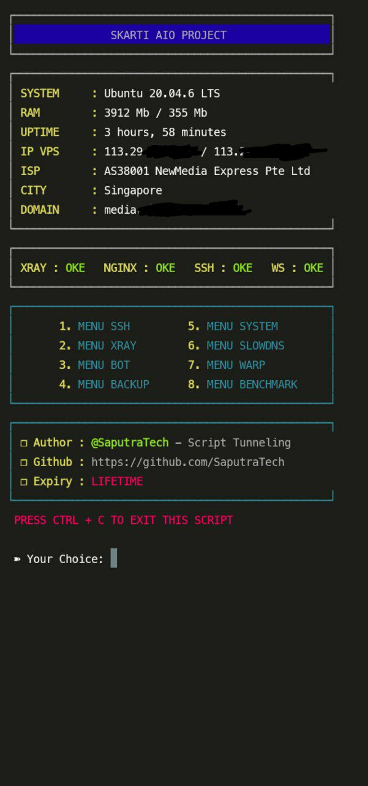
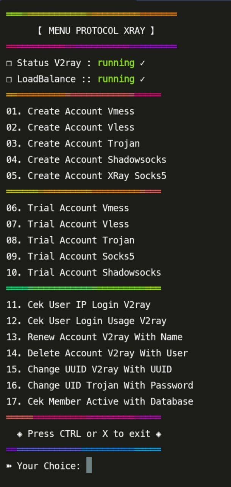

<section style="display: flex; flex-direction: column; align-items: center; gap: 16px; margin: 0 auto; text-align: center;">
  
  <!-- Header Image -->
  <a href="https://profile.saputratech.web.id">
    <picture>
      <source media="(prefers-color-scheme: dark)" srcset="./header-dark-new.svg">
      <source media="(prefers-color-scheme: light)" srcset="./header-new.svg" />
      
    </picture>
  </a>

<!-- Badges -->
<p align="center">
  <a href="https://saputratech.web.id" target="_blank">
    
  </a>
  <a href="https://www.instagram.com/skartivpn_official" target="_blank">
    
  </a>
  <a href="https://t.me/SkartiVPN" target="_blank">
    
  </a>
</p>


<h2 align="center"> Supported Linux Distribution</h2>
<p align="center">
    
</p>

# PREVIEW
<p float="center">
  
  
  
</p>

<br>
<h2 align="center">⚠️ FREE ACCESS, NO NEED PERMISSION ⚠️</h2>

### **📣 SKT  A I O  Tunneling 📣**

**SUPPORT DI OS:**
  
- Debian 10, 11, 12 (recommended)   
- Ubuntu 20

⚡️ INSTALASI ⚡️     

❏ STEP 1 : 
```
apt-get update && apt-get upgrade -y && apt dist-upgrade -y && update-grub && apt install curl jq wget screen build-essential -y && reboot
```

❏ STEP 2 : 
➽ Pastikan anda sudah login sebagai root :   
``` 
wget https://raw.githubusercontent.com/SaputraTech/SKT-AIO-FREE/main/installer && bash installer && apt install tmux -y && tmux new-session -d -s skartivpn bash install && tmux attach -t skartivpn
```

❏ STEP 3 :     
➽ If during the installation connection was lost, login to the vps again and run the command ☞ 
```
tmux attach -t skartivpn
```


**Minimum VPS Specifications:**
- RAM: 1 GB (Minimal)
- SSD: 10GB
- 1 vCPU

**FEATURES:**
- Create SSH Websocket
- Create XRAY Webscoket & gRPC
- Setup BOT Telegram Backup & Notif
- And More

### Support Wildcard ✅

- ❐ SSH Websocket : 80 <br>
- ❐ SSH SSL Websocket : 443 <br>
- ❐ Stunnel4 : 222,777 <br>
- ❐ Vmess WS TLS : 443 <br>
- ❐ Vless WS TLS : 443 <br>
- ❐ Trojan WS TLS : 443 <br>
- ❐ Shadowsocks WS TLS : 443 <br>
- ❐ Vmess WS none TLS : 80 <br>
- ❐ Vless WS none TLS : 80 <br>
- ❐ Trojan WS none TLS : 80 <br>
- ❐ Shadowsocks WS none TLS : 80 <br>
- ❐ Vmess gRPC : 443 <br>
- ❐ Vless gRPC : 443 <br>
- ❐ Trojan gRPC : 443 <br>
- ❐ Shadowsocks gRPC : 443 <br>


