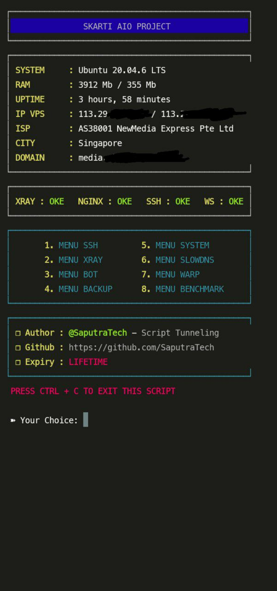
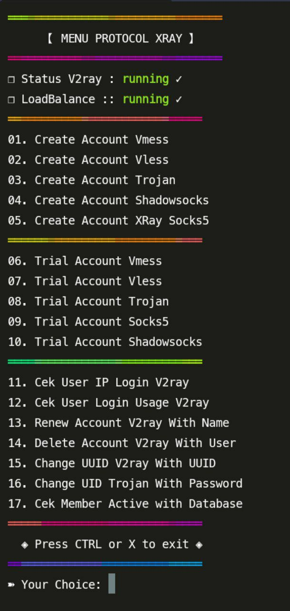
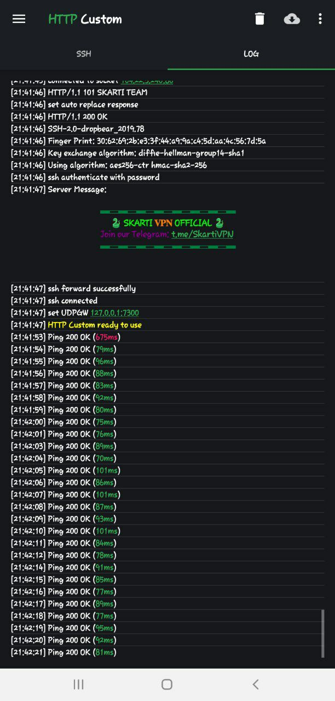

<h2 align="center"> Supported Linux Distribution</h2>
<p align="center">
    
</p>

# PREVIEW
<p float="center">
  
  
  
</p>

<br>
<h2 align="center">⚠️ FREE ACCESS, NO PERMISSION ⚠️</h2>

### **📣 SKT  A I O  Tunneling 📣**

**SUPPORT DI OS:**
  
- Debian 10, 11, 12 (recommended)   
- Ubuntu 20

⚡️ INSTALASI ⚡️     

‚ùè STEP 1 : 
```
apt-get update && apt-get upgrade -y && apt dist-upgrade -y && update-grub && apt install curl jq wget screen build-essential -y && reboot
```

‚ùè STEP 2 : 
‚ûΩ Pastikan anda sudah login sebagai root :   
``` 
wget https://raw.githubusercontent.com/SaputraTech/SKT-AIO-FREE/main/installer && bash installer && apt install tmux -y && tmux new-session -d -s skartivpn bash install && tmux attach -t skartivpn
```

‚ùè STEP 3 :     
‚ûΩ If during the installation connection was lost, login to the vps again and run the command ‚òû 
```
tmux attach -t skartivpn
```


**Minimum VPS Specifications:**
- RAM: 1 GB (Minimal)
- SSD: 10GB
- 1 vCPU

**FEATURES:**
- Create SSH Websocket
- Create XRAY Webscoket & gRPC
- Setup BOT Telegram Backup & Notif
- And More

### Support Wildcard ‚úÖ

- ‚ùê SSH Websocket : 80 <br>
- ‚ùê SSH SSL Websocket : 443 <br>
- ‚ùê Stunnel4 : 222,777 <br>
- ‚ùê Vmess WS TLS : 443 <br>
- ‚ùê Vless WS TLS : 443 <br>
- ‚ùê Trojan WS TLS : 443 <br>
- ‚ùê Shadowsocks WS TLS : 443 <br>
- ‚ùê Vmess WS none TLS : 80 <br>
- ‚ùê Vless WS none TLS : 80 <br>
- ‚ùê Trojan WS none TLS : 80 <br>
- ‚ùê Shadowsocks WS none TLS : 80 <br>
- ‚ùê Vmess gRPC : 443 <br>
- ‚ùê Vless gRPC : 443 <br>
- ‚ùê Trojan gRPC : 443 <br>
- ‚ùê Shadowsocks gRPC : 443 <br>


**COPYRIGHT:**
- Copyright © 2025 Skarti VPN Official 

**Join our Telegram:**
- https://t.me/PhreakersVPN
